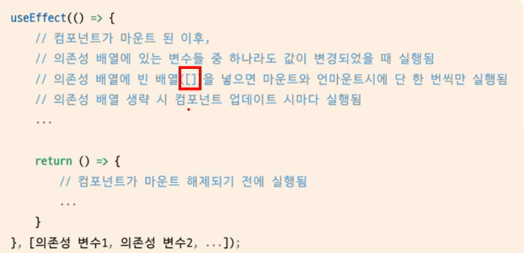
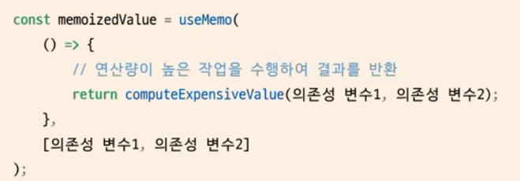

# 박준성

***
<details>
<summary>13주차 5/25</summary>
<div markdown='1'>

## 13주차 5/25
### 복습
```javascript
// 복습
// Provider 를 통해 상위 컴포넌트에서 값을 전달해주지 않으면 기본값 사용
const MyContext = React.createContext(기본값);
const UserContext = React.createContext({
  name: "username"
});

// useContext 를 통해 값을 쉽게 불러올 수 있음
const value = useContext(UserContext);


// Provider 를 통해 값을 전달하는 방법
<MyContext.Provider value={전달하고 싶은 값}>
  <Component />
</MyContext.Provider>
```
### CSS
```css
/* display : 엘리먼트를 어떻게 표시할지에 관한 속성 */
div {
  display: none | block | inline | flex;
}

/* visibility : 화면에 보이는지 여부 결정하는 속성 */
div {
  visibility: visible | hidden;
}

/* position : 엘리먼트를 어떻게 위치시킬 것인지를 정의하는 속성 */
div {
  position: static | fixed | relative | absolute;
}
/* 
static : 원래의 순서대로 위치
fixed : 브라우저 window 에 상대적으로 위치
relative : 보통의 위치에 상대적으로 위치 (left : 16px; 왼쪽에 16px 여백 추가)
absolute : 절대 위치에 위치 이때 기준은 첫 번째 상위 엘리먼트 
*/

/* flex : 플렉스 아이템이 자신의 컨테이너가 차지하는 공간에 맞추기 위해 크기를 키우거나 줄이는 방법을 설정하는 속성 */
div {
  display: flex;
  flex-direction: row | column | row-reverse | column-reverse;
  align-items: stretch | flex-start | center | flex-end | baseline;
  justify-content: flex-start | center | flex-end | space-between | space-around;
}


```
</div>
</details>

***
<details>
<summary>12주차 5/18</summary>
<div markdown='1'>

## 12주차 5/18
### 합성
* 여러 개의 컴포넌트를 합쳐서 새로운 컴포넌트를 만드는 것
### 합성의 종류
1. Containment 포함
  * 특정 컴포넌트가 하위 컴포넌트를 포함하는 형태의 합성 방법
  * 주로 범용적인 박스 역할을 하는 Sidebar 혹은 Dialog 와 같은 컴포넌트에서 사용
  * 리액트에서는 props.childrean 을 통해 하위 컴포넌트를 하나로 모아서 제공
```javascript
export default function Card(props) {
    const { title, backgroundColor, children } = props; // props.child 를 활용하여 받기

    return (
        <div
            style={{
                margin: 8,
                padding: 8,
                borderRadius: 8,
                boxShadow: "0px 0px 4px grey",
                backgroundColor: backgroundColor || "white"
            }}
        >
            {title && <ht>{title}</ht>}
            {children}
        </div>
    )
}
```
* React.createElement
```javascript
// jsx 를 이용한 방법
const jsxElement = <h1 className='jax'> JSX element </h1>

// react 를 사용한 방법
const reactElement = React.createElement(
  'h1', // tag
  {className: 'obj'}, // props
  'OBJ Element' // child element
)
```
2. Specialization 특수화, 전문화
* 범용적인 개념을 구별이 되게 구체화하는 것 -> 특수화

3. Containment 와 Specialization 을 같이 사용
  * Containment 를 위해 props.children 사용 및 Specialization 을 위해 props 직접 정의

### 상속
*  자식 클래스는 부모 클래스가 가진 변수나 함수 등의 속성을 모두 가짐

### Context 
* 리엑트 컴포넌트들 사이에서 데이터를 기존의 props 를 통해 전달하는 방식 대신 <b>컴포넌트 트리를 통해 곧바로 컴포넌트에 전달하는 새로운 방식</b>을 제공
* 여러 컴포넌트에 필요한 데이터인 로그인 여부, 정보 혹은 UI 테마, 현재 선택된 언어 등을 전달할 떄 사용
* 컨텍스트를 사용하려면 컴포넌트의 상위 컴포넌트에서 Provider 로 감싸주어야함
```javascript
function Theme(props) { // 상위 컴포넌트에서 provider 를 통해 값 제공
  return (
    <ThemeContext.Provider value="dark">
      <Toolbar/>
    </ThemContext.Provider>
  )
}

function Toolbar(props) {
  return (
    <div>
      <ThemedButton />
    </div>
  )
}

function ThemedButton(props) {
  // 리액트는 가장 가까운 상위 테마 Provider 를 찾아서 해당되는 값을 사용
  // Provider 가 없을 경우 기본 값 사용
  // 상위 Provider 가 있기 때문에 현재 테마의 값을 dark 로 사용
  return (
    <ThemeContext.Consumer>
      {value => <Button them={value} />}
    </ThemeContext.Consumer>
  )
}
```
#### Context 사용 시 고려할 점
* 컨텍스트는 다른 레벨의 많은 컴포넌트가 특정 데이터를 필요로 하는 경우에 주로 사용
* 컨텍스트는 결합력이 높아 재사용성이 떨어짐 => 특정 컴포넌트에만 접근하는 데이터의 경우 props 를 통한 전달이 좋음
* 다양한 레벨이 중첩된 컴포넌트들의 접근이 필요할 경우 컨텍스트 사용이 유리
#### Context.Provider
* Context.Provider 컴포넌트로 하위 컴포넌트들을 감싸주면 모든 하위 컴포넌트들이 해당 컨텍스트에 접근할 수 있게 됨
* value 라는 prop 이 있고 이를 Provider 컴포넌트 하위에 있는 컴포넌트에 전달
* Provider 컴포넌트가 재랜더링될 때 하위 컴포넌트도 재랜더링되므로 주의 -> useState 로 다루는 변수를 사용하기
</div>
</details>

***
<details>
<summary>11주차 5/11</summary>
<div markdown='1'>

## 11주차 5/11
### 시험 피드백 및 실습
</div>
</details>

***
<details>
<summary>10주차 5/4</summary>
<div markdown='1'>

## 10주차 5/4
### 리스트와 키
### 1. 리스트와 키란 무엇인가?
* 리스트는 자바스크립트의 변수나 객체를 하나의 변수로 묶어 놓은 배열과 같은 것
* 키는 각 객체나 아이템을 구분할 수 있는 고유한 값을 의미
* 리액트에서는 배열과 키를 사용하는 반복되는 다수의 엘리먼트를 쉽게 렌더링할 수 있음

### 2. 여러 개의 컴포넌트 렌더링하기
* 같은 컴포넌트를 화면에 반복적으로 나타내야 할 경우 배열에 들어있는 엘리먼트를 map()함수를 이용하여 렌더링
```javascript
const doubled = numbers.map((number) => number * 2);
```

### 리액트에서 map()함수를 사용한 예제
```javascript
    const numbers = [1, 2, 3, 4, 5];
    const listItems = numbers.map((number) =>   
        <li>{number}</li>);
```
### numbers의 요소에 태그를 결합해서 리턴
```javascript
    ReactDom.render(
        <ul>
            <li>{1}</li>
            <li>{2}</li>
            <li>{3}</li>
            <li>{4}</li>
            <li>{5}</li>
        </ul>,
        document.getElementById('root')
    );
```

### 기본적인 리스트 컴포넌트는 props로 받은 숫자를 numbers로 받아 리스트로 렌더링
```javascript
    function NumberList(props) {
        const { numbers } = props;

        const listItems = numbers.map((number) =>
            <li>{number}</li>
        );

        return (
            <ul>{listItems}</ul>
        );
    }
    const numbers = [1, 2, 3, 4, 5];
    ReactDom.render(
        <NumberList numbers={numbers} />,
        document.getElementById('root')
    );
// 출석부 출력하기
     import React from "react";
  // 리액트에서 키값은 어떤 아이템이 변경, 추가 또는 제거되었는지 구분하기 위해 사용  
  // 리액트의 배열은 C언어의 배열과는 다르게 한가지 값이 아니라 여러 속성을 넣을수 있다
const students = [ {
id: 1, name: "Inje", }, {
id: 2, name: "Steve", }, {
id: 3, name: "Bill", }, {
id: 4, name: "Bill", }, ];

function AttendanceBook(props) { return (

{students.map((student, index) => { return
{student.name}
; })}
); }
export default AttendanceBook; 
```


요약

* 리스트 : 같은 아이템을 순서대로 모아놓은 것
* 키 : 각 객체나 아이템을 구분할 수 있는 고유한 값
* 여러 개의 컴포넌트 렌더링
* 자바스크립트 배열의 map()함수를 사용
* 배열에 들어있는 각 변수에 어떤 처리를 한 뒤 결과(엘리먼트)를 배열로 만들어서 리턴함
* map()함수 안에 있는 엘리먼트는 꼭 키가 필요함
다양한 키값의 사용법

### 폼
### 1.폼이란 무엇인가?
폼은 일반적으로 사용자로부터 입력을 받기위한 양식에서 많이 사용
```javascript
    <form>
        <label>
            이름:
            <input type="text" name="name"/>       
        </label>
        <button type="submit">제출<button>
    </form>
```
### 제어 컴포넌트
제어 컴포넌트는 사용자가 입력한 값에 접근하고 제어할 수 있도록 해주는 컴포넌트
### 제어 컴포넌트 예시
```javascript
    function Nameform(props) {
        const [value, setValue] = useState("");

        const handleChange = (event) => {
            setValue(event.target.value);
        }

        const handleSubmit = (event) => {
            alert('입력한 이름: ' + value);
            event.preventDefault();
        }

        return (
            <form onSubmit={handleSubmit}>
                <label>
                    이름:
                    <input type="text" value={value} onChange={handleChange} />
                </label>
                <button type="submit">제출</button>
            </form>
        )
    }
```
textarea 태그
HTML에서는 <textarea>의 children으로 텍스트가 들어가는 형태입니다.
    <textarea>
        안녕하세요, 여기에 이렇게 텍스트가 들어가게 됩니다.
    </textarea>
리액트에서는 state를 통해 태그의 value라는 attribute를 변경하여 텍스트를 표시합니다.
```javascript
    function RequestForm(props) {
        const [value, setValue] = useState('요청사항을 입력하세요.');
    }
```
요약
* 제어 컴포넌트
* 사용자가 입력한 값에 접근하고 제어할 수 있게 해주는 컴포넌트
* 값의 리액트의 통제를 받는 입력 폼 엘리먼트
```javascript
<input type="text"> 태그 : 한 줄로 텍스트를 입력받기 위한 HTML 태그
리액트에서는 value라는 attribute로 입력된 값을 관리
<textarea> 태그 : 여러 줄에 걸쳐서 텍스트를 입력받기 위한 HTML태그 - 리액트에서는 value라는 attribute로 입력된 값을 관리
태그 드롭다운 목록을 보여주기 위한 HTML 태그 여러 가지 옵션 중에서 하나 또는 여러 개를 선택할 수 있는 기능을 제공 리액트에서는 value라는 attribute로 선택된 옵션의 값을 관리 태그
디바이스의 저장 장치로부터 사용자가 하나 또는 여러 개의 파일을 선택할 수 있게 해주는 HTML 태그
서버로 파일을 업로드하거나 자바스크립트의 File API를 사용해서 파일을 다룰 때 사용
```
</div>
</details>

***
<details>
<summary>9주차 4/27</summary>
<div markdown='1'>

## 9주차 4/27
### Event
* DOM 에서 클릭 이벤트 처리
```javascript
<button onclick="activate()">
  Activate
</button>
```

* React 에서 클릭 이벤트 처리
```javascript
<button onClick={activate()}>
  Activate
</button>
```
* 이벤트 핸들러로 클릭 이벤트 처리
  * 클래스 컴포넌트에서의 이벤트 처리 예제
```javascript
class Toggle extends React.Component {
  constructor(props) {
    super(props);

    this.state = { isToggleOn: true};

    // callback 에서 this 를 사용하기 위해서 바인딩 필수적
    this.handleClick = this.handleClick.bind(this);
  }

  handleClick() {
    this.setState(prevState => ({
      isToggleOn: !prevState.isToggleOn
    }))
  }

  render() {
    return (
      <button onClick={this.handleClick}>
        {this.state.isToggleOn ? '켜짐': '꺼짐'}
      </button>
    );
  }
}
```

  * 함수형 컴포넌트에서의 이벤트 처리 예제
```javascript
function Toggle(props) {
  const [isToggleOn, setIsToggleOn] = useState(true);

  // 1. 함수 안에 함수로 정의
  function handleClick() {
    setIsToggleOn((isToggleOn) => !isToggleOn);
  }

  // 2. arrow function 을 사용하여 정의
  const handleClick = () => {
    setIsToggleOn((isToggleOn) => !isToggleOn);
  }

  return (
    <button onClick={handleClick}>
      {isToggleOn ? '켜짐' : '꺼짐'}
    </button>
  )
}
```

### Arguments 전달
* 함수를 정의할 때는 Parameter 혹은 매개변수, 사용할 때는 Argument 혹은 인자라고 부름

* 이벤트 핸들러에 매개변수를 전달하는 경우도 있음
```javascript
// 화살표 함수를 통한 인자 전달
<button onClick={(event) => this.deleteItem(id, event)}>delete</button>
// bind 를 통한 인자 전달
<button onClick={this.deleteItem.bind(this, id)}>delete</button>

// event 라는 매개변수는 리엑트의 이벤트 객체를 의미
// 첫번째 코드는 명시적으로 event 를 매개변수로 넣어주었고 (함수형 컴포넌트),
// 두 번째 코드는 id 이후 두번째 매개변수로 event 자동 전달됨 (클래스형 컴포넌트)
```

### 조건부 렌더링
```javascript
function Greeting(props) {
  const isLoggedIn = props.isLoggedIn;
  if (isLoggedIn) {
    return <UserGreeting />;
  }
  return <GuestGreeting />;
}
```

### 엘리먼트 변수
* 렌더링해야 될 컴포넌트를 변수처럼 사용하는 방법
```javascript
let button;
if (isLoggedIn) {
  // LogoutButton 이나 LoginButton 을 state 에 따라 변수에 컴포넌트 객체를 저장하여 사용
  button = <LogoutButton onClick={handleLogoutClick} />
} else {
  button = <LoginButton onClick={handleLoginClick} />
}

return (
  <div>
    <Greeting isLoggedIn={isLoggedIn} />
    {button}
  </div>
)
```

### 인라인 inline 
1. 조건
* if 문을 직접 사용하지 않고, 동일한 효과를 내기 위해 && 논리 연산자를 사용
* && : 모든 조건이 참일 때 = true 반환 (즉 첫번째 조건이 거짓이면 두번째 조건은 판단 X)
```javascript
{unreadMessages.length > 0 &&
  <h2>
    현재 {unreadMessages.length} 개의 읽지 않은 메시지가 있습니다
  </h2>
}
```

2. if - else
* 삼항 연산자 사용
```javascript
function UserStatus(props) {
  return (
    <div>
      <div>
        이 사용자는 현재 <b>{props.isLoggedIn ? '로그인' : '로그인하지 않은'}</b> 상태입니다
      </div>

      <div>
        <Greeting isLoggedIn={isLoggedIn} />
        {isLoggedIn
          ? <LogoutButton onClick={handleLogoutClick} />
          : <LoginButton onClick={handleLoginClick} />
        }
      </div>
    </div>
  )
}
```

3. 컴포넌트 렌더링 막기
```javascript
function WarningBanner(props) {
  if (!props.warning) {
    return null;
  }
  return (
    <div>
      경고
    </div>
  )
}
```

</div>
</details>

***
<details>
<summary>7주차 4/13</summary>
<div markdown='1'>

## 7주차 4/13
### Hook
* 함수형 컴포넌트에서 state 나 생명주기함수의 기능을 사용하게 해주기 위해 추가된 기능

1. **useState** : const [변수명, set함수명] = useState(초깃값);
* 함수형 컴포넌트에서 state 를 변경하기 위한 함수
* 함수를 호출할 때 변수에 초깃값 설정
```javascript
// const [변수명, set함수명] = useState(초깃값);
// Ex ) 
const [count, setCount] = useState(0);
return (
  <div>
    <p>{setCount(count + 1)}</p>
  </div>
)
```
2. **useEffect** : useEffect(이펙트 함수, 의존성 배열);
* side effect(부가적인 작용) 를 수행하기 위한 함수
* 클래스 컴포넌트의 생명주기 함수와 같은 기능을 하나로 통합하여 제공하는 함수
* 렌더링된 이후, 재랜더링된 이후에 실행
* 의존성 배열의 값이 변화할 때 이펙트 함수가 사용됨
* 마운트와 언마운트 될 때만 한 번씩 실행하게 하고 싶으면 빈 배열을 넣어주면 됨 
```javascript
// useEffect(이펙트 함수, 의존성 배열);
// Ex) 아래 예시는 의존성 배열이 없음
UseEffect(() => {
  document.title = `총 ${count}번 클릭`
}); // 의존성 배열 없이 사용 시 랜더링 이후 해당 이펙트 함수가 실행됨
```
* useEffect() 에서 반환하는 함수는 컴포넌트가 마운트될 때나 해제될 때 호출


3. **useMemo** : useMemo(메모 함수, 의존성 배열)
* Memoized value 를 반환하는 훅
* 이전 계산값을 갖고 있어 반복 작업에 좋음
* 랜더링이 일어나는 동안 실행
* 의존성 배열을 넣지 않으면 랜더링할 때마다 함수 실행
=> 반복작업을 줄이고자하는 함수 기능을 사용 X


4. **useCallback** : useCallback(콜백 함수, 의존성 배열)
* useMemo 와 의존성 배열을 파라미터로 받는 것은 일치하지만 값이 아닌 함수를 반환 ( 파라미터로 받은 함수를 콜백이라고 부름 )
* useMemo 와 마찬가지로 의존성 배열이 변경될 시 콜백함수 반환

5. **useRef** : const 변수명 = useRef(초깃값);
* 레퍼런스란 특정 컴포넌트에 접근할 수 있는 객체를 의미
* .current 라는 속성이 있는데 현재 참조하고 있는 엘리먼트 의미
```javascript
const refContainer = useRef(초깃값);
// 이 변수는 컴포넌트의 생명주기 전체에 걸쳐서 유지 ( 마운트 해제 전까지 )
```
### 훅의 규칙
* 최상위 레벨에서만 호출해야함 ( 컴포넌트 최상위 )
  * 반복문이나 조건문 중첩된 함수들 안에서 훅 호출 X
  * 컴포넌트가 랜더링 될 때마다 같은 순서로 호출되어야함
* 함수형 컴포넌트에서만 훅 호출
    * 일반 자바스크립트에서 훅 호출 X
    * 클래스 컴포넌트에서 훅 호출 X
</div>
</details>

***
<details>
<summary>6주차 4/06</summary>
<div markdown='1'>

## 6주차 4/06
### state 와 생명주기
State
* 컴포넌트의 상태 = 컴포넌트의 변경가능한 데이터를 의미
* State 가 변하면 다시 렌더링이 되기 때문에 렌더링과 관련된 값만 state 에 포함시켜야함 ( Ex :함수형 컴포넌트 => useState )

생명주기 ( class 형 컴포넌트가 해당 )
* 컴포넌트의 생성 시점, 사용 시점, 종료 시점을 말함
* constructor 가 실행되면서 컴포넌트 생성
=> class 형 컴포넌트만 생명주기를 가짐

### 오늘 한 실습
1. Comment 컴포넌트 작성
2. CommentList 컴포넌트 안에 Comment 컴포넌트의 props 값 입력
3. 기존의 index.js 에서 setInterval 제거
4. CommentList 컴포넌트 안에서 props 를 json 배열의 객체값에서 꺼내어 사용

</div>
</details>

***
<details>
<summary>5주차 3/30</summary>
<div markdown='1'>

## 5주차 3/30
### Element
* 리액트 요소는 자바스크립트 객체의 형태로 존재
* 컴포넌트 (Button 등), 속성(color 등) 및 내부의 모든 childen 을 포함하는 일반 JS 객체
* 불변성을 가지고 있음
* Virtual DOM


### Element 렌더링
render 함수를 통해 virtual DOM 구조를 DOM 구조로 다시 바꾸는 과정을 말함

### Component
* 컴포넌트 기반의 구조
* 컴포넌트 재사용이 가능 => 전체 코드 양 감소 => 개발 시간 및 유지 보수 비용 감소
* 입력 Porps 출력 React Element
* 이름은 항상 대문자로 ( 리액트는 소문자로 시작하는 태그를 html tag (DOM) 으로 인식하기 때문 )
* 컴포넌트 합성 (컴포넌트 안에 또 다른 컴포넌트 사용 가능)
```javascript
function Component(props) {
  return <h1>Hello {props.name}</h1>
}

function App(props) {
  return (
    <div>
      <Component name="준성" />
      <Component name="인호" />
    </div>
  )
}

ReactDOM.render(
  <App/>,
  document.getElementById('root')
)
```
*최근에는 클래스형 컴포넌트보다 함수형 컴포넌트 사용 ( 생명주기의 유무, Hook 개념 발생 )

### Props 
* 컴포넌트의 속성
* Props 에 따라 컴포넌트에서 다른 element 가 나옴
* JSX 에서 key-value 로 구성
*Pure 함수 ( props 를 바꾸지 않음 ) 형태를 가짐


```javascript
function App (props) {
  return (
    <Layout
      name="준성",
      age={25}
      width={2560},
      height={1440},
      header={
        <Header head="준성's github">
      }
      footer={
        <Footer/>
      }
    />
  )
}
```
* JSX 없이 사용시
```javascript
React.createElement(
  name="준성",
  age={25}
)
```
</div>
</details>

***
<details>
<summary>4주차 3/23</summary>
<div markdown='1'>

## 4주차 3/23
## React 와 JSX
아래와 같은 변수 선언이 가능한 것은 React 뿐이며 이러한 표현식을 포함하는 확장자가 JSX 이다
```javascript
const name = 'Josh Perez';
const element = <h1>Hello, {name}</h1>;
```
```javascript
function formatName(user) {
  return user.firstName + ' ' + user.lastName;
}

const user = {
  firstName: 'Harper',
  lastName: 'Perez'
};

const element = (
  <h1>
    Hello, {formatName(user)}!
  </h1>
);
```
```javascript
function getGreeting(user) {
  if (user) {
    return <h1>Hello, {formatName(user)}!</h1>;
  }
  return <h1>Hello, Stranger.</h1>;
}
```
이러한 표현식들을 사용한 JSX 표현식이 javascript 함수 호출이 되고 javascript 객체로 인식
=> Babel 엔진이 JSX 를 React.createElement() 호출로 컴파일
```javascript
JSX 표현식
const element = (
  <h1 className="greeting">
    Hello, world!
  </h1>
);
====================================================
javascript 로 컴파일된 표현식
const element = React.createElement(
  'h1',
  {className: 'greeting'},
  'Hello, world!'
);
```

### JSX 의 장점
1. 코드 간결해짐
2. 가독성 향상
3. Injection Attack 이라 불리는 해킹 방법을 방어
</div>
</details>

***
<details>
<summary>3주차 3/16</summary>
<div markdown='1'>

## 3주차 3/16
## 1. README 작성요령
# 이름 : 박준성 (h1)
## 강의 날짜 : 3/16 (h2)
## 학습 내용 (필수) : h2 이하 사이즈 자유 사용 (h2)
```
작성 코드 (선택)
최근 내용이 위에 오도록 작성
날짜 별 구분이 잘 가도록 작성
```
## 2. node.js
### node.js lts 설치 후
```
<!-- 노드 버전 확인 -->
node -v
node --version
npm -v
npx -v
```
## 3. React
<b>자바스크립트로 이루어진 랜더링 라이브러리</b>
### 리엑트의 장점
1. 빠른 업데이트와 렌더링 속도
    + Virtual DOM 구조
    + 비동기식 구조 (asynchronization)
2. 컴포넌트 ( components ) 기반 구조
    + 하나의 컴포넌트는 다른 여러 개의 컴포넌트의 조합으로 구성 가능
    + 재사용성 증가 ( 재사용성은 모듈의 의존성과 반비례)
3. Meta(facebook) 에서 오픈소스 프로젝트로 관리
    + 대기업의 관리하에 발전
    + 활발한 지식 공유 및 커뮤니티

### 리엑트의 단점
1. 방대한 학습량
    + 자바스크립트 지식이 받쳐줄 경우 해당 X
2. 높은 상태 관리 복잡도
    + state, component life cycle 등 개발 환경 내에서는 복잡하지만 개념 자체는 어렵지 않음
## 4. React 실행하기

1. 터미널 생성
2. 원하는 디렉토리 위치로 이동
3. npx create-react-app [project name] 입력
4. 설치 과정이 다 끝나면 해당 app 디렉토리로 이동
5. npm start 입력

### 종료 시
1. 터미널에 관리자 권한으로 접속
2. netstat -ano 입력
3. ctrl + f 누르고 3000 검색
4. 해당 포트 번호의 pid 를 확인
5. taskkill /f /pid [포트 번호의 pid] 입력
</div>
</details>

***
<details>
<summary>2주차 3/09</summary>
<div markdown='1'>

## 2주차 3/9
## React 강의
SPA(Single page Application)
-자바스크립트
1.E56 (ECMAScript6) - 표준 ECMA-262

2.자바스크립트의 자료형
var : 중복 선언 가능, 재할당 가능
let : 중복 선언 불가능, 재할당 가능
const : 중복 선언 불가능, 재할당 불가능

===================== git 정보확인<br>
config 확인방법<br>
우선 순위는 Local>global>System순이며 Local 이 설정권한이 가장 높음<br>
설정 파일 확인 : git config --system --list<br>
Global 설정 파일 확인 : git config --global --list<br>
Local 설정 파일 확인 : git config --local --list<br>
모든 설정 확인 : git config --list<br><br>

사용자 등록 : git config --global user.name<br>
이메일 등록 : git config --global user.email<br>
사용자 초기화 : git config --global --unset-all user.name
</div>
</details>